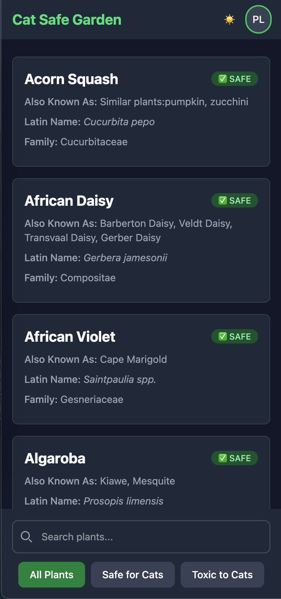

# Furry Garden: A Plant Safety Guide for Pet Owners



Furry Garden is a web application designed to help pet owners quickly identify plants that are toxic or safe for their cats. The goal is to provide an easy-to-use resource to ensure the well-being of your furry friends by helping you make informed decisions about the plants in your home and garden.

## Data Source

The plant safety data used in this application is extracted from the comprehensive database provided by the ASPCA (American Society for the Prevention of Cruelty to Animals). We utilize the [aspca-exporter](https://github.com/mgolebiowski/aspca-exporter) tool to programmatically extract and process this valuable information from the official ASPCA website: [https://www.aspca.org/pet-care/animal-poison-control/cats-plant-list](https://www.aspca.org/pet-care/animal-poison-control/cats-plant-list).

A huge thank you to ASPCA for maintaining such an invaluable database and making this crucial information available to pet owners!

## How to Run

To get Furry Garden up and running on your local machine, follow these steps:

1.  **Clone the repository:**
    ```bash
    git clone https://github.com/mgolebiowski/furry-garden.git
    cd furry-garden
    ```

2.  **Install dependencies:**
    ```bash
    npm install
    ```

3.  **Run the development server:**
    ```bash
    npm run dev
    ```
    This will start the development server, and you can access the application in your web browser, usually at `http://localhost:4000`.

4.  **Build for production (optional):**
    ```bash
    npm run build
    ```
    This command will build the optimized production-ready version of the application in the `dist/` directory.

## Recommended IDE Setup

[VS Code](https://code.visualstudio.com/) + [Svelte](https://marketplace.visualstudio.com/items?itemName=svelte.svelte-vscode).